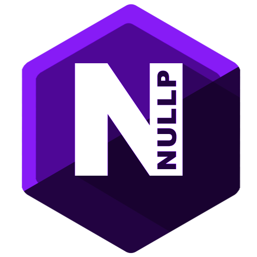

<div id="top">
    <br />
    <div align="center">
        <a href="./images/NullP-Logo.png">
            
        </a>
        <h3 align="center">NULLP INTERPRETER</h3>
        <p align="center">
            An interpreter for the (invented) language NULLP and just made for fun.
            <br />
        </p>
    </div>
</div>

# About
NULLP is a made up programming language created for the only purpose to test out how a language and the interpreter made for it works. The interpreter is written in C#.

## Example Program I

```JavaScript
namespace Program
{
	// Forward declaration for class
	class FruitManager;
	
	// Main function for us to execute
	function Main()
	{
		// Create new instance of fruit manager
		var fruitManager = new FruitManager();
		// Call functions of instance
		Console.WriteLine("User has chosen: " + fruitManager.AskForFruit("apple"));	
	}
	
	// Fruit Manager class
	class FruitManager
	{
		function AskForFruit(favorite)
		{
			// Print something to the console
			Console.WriteLine("What's your favorite fruit?");
			// Read input
			var answer = Console.ReadLine();
			
			if (answer == favorite)
			{
				Console.WriteLine("Good choice!");
				return favorite;
			}
			else
			{
				Console.WriteLine("Not my favorite but okay.");
			}
			
			return answer;
		}
	}
}
// Execute function
Program.Main();
```

### Output
```
What's your favorite fruit?
[Input] > apple
Good choice!
User has chosen: apple
```

## Language Features

### Variables

#### Definition
```JavaScript
var variableName;
// or
var variableName = initialValue;
```
#### Assignment
```JavaScript
variable = newValue;
variable = FunctionCall();
```

#### Types
```JavaScript
// String
var string = "This is a string";

// Numbers with and without floating point
var number = 1.0;
var numberWithoutFloatingPoint = 1;

// Lists that can hold any object
var list = ["value 1", 2];

// Null... is just null
var nullObject = null;
```

#### Indexing
```JavaScript
var string = "Hello World";
var list = [0, 1, 2, 3, 4];

var firstLetter = string[0]; // var firstLetter is now 'H'
var firstIndex = list[0]; // var firstIndex is now '0'

// Ranged indexer
var hello = string[0..4]; // var hello is now 'Hello'
var firstThree = list[0..2]; // var firstThree is now '[0, 1, 2]'
```

### Functions

#### Definition
```JavaScript
function FunctionThatIsFoundSomewhereBelow; // <-- Forward declaration if needed

function FunctionName(parameter1, parameter 2, etc)
{
    // Function body here
    // Optional return statement in functions
    return varX;
}

// Call function
FunctionName(param1, "param2", 3, etc);
```

### Classes

```JavaScript
class ClassName; // <-- Forward declaration if needed

class ClassName
{
    // Attributes of the class
    var classAttribute = null;

    // Constructor is the function named equals to the class name
    function ClassName()
    {
        // Do something
    }

    function OtherClassFunction()
    {
        // Do something
    }
}

// Create class instance
var classInstance = new ClassName();
// Execute function of class / instance
classInstance.OtherClassFunction();
```

### Namespaces
```C#
namespace NamespaceName
{
    var varInNamespace = 1;
    // Functions, classes etc go here.
}

var x = NamespaceName.varInNamespace;
```

### If-Statement

```JavaScript
// Is equals to
if (variable1 == "expectedValue")
{
    // Code
}
else
{
    // Code
}
```

```JavaScript
// Is not equals to
if (variable1 != "expectedValue")
{
    // ...
}
```

### While-Loop

```JavaScript
while (stack.count > 0)
{
    // Do something
}
```

## Static Functions

```C#
Console.WriteLine(textToPrint) : null
```

```C#
Console.ReadLine() : string
```